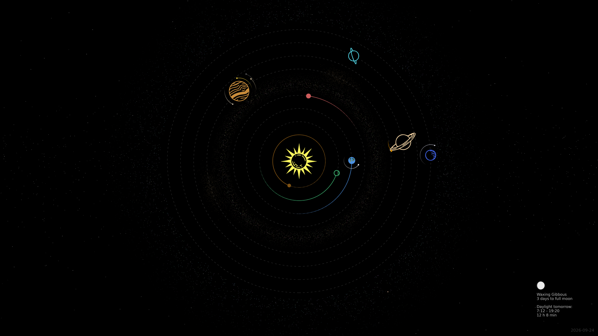

# Solarmap Wallpaper

A Python script that generates a visualization of our solar system as a desktop wallpaper.



## Features

- Real-time planetary positions using astronomical calculations
- Orbital trails showing recent planetary motion
- 17 largest objects (until Pluto) visualized and positions calculated
- Asteroid belt and Kuiper belt visualization
- Sunrise/sunset times (dependant on your set location coordinates)
- Customizable resolution and colors

## Requirements

- Python 3.x
- See `requirements.txt` for dependencies

## Installation
```bash
git clone https://github.com/yourusername/solarmap.git
cd solarmap
python -m venv venv
source venv/bin/activate  # On Windows: venv\Scripts\activate
pip install -r requirements.txt
```

## Usage
```bash
python solarmap.py
```

The script generates `solarmap.png` in the current directory.

## Configuration

Edit the configuration section in `solarmap.py`:

- `width_px`, `height_px` - Output resolution
- `latitude`, `longitude` - Your location for weather/sunrise times
- `custom_date` - Set a specific date or use "Now"
- `planet_colors` - Customize planet colors

## License

MIT License - see [LICENSE](LICENSE) file for details
